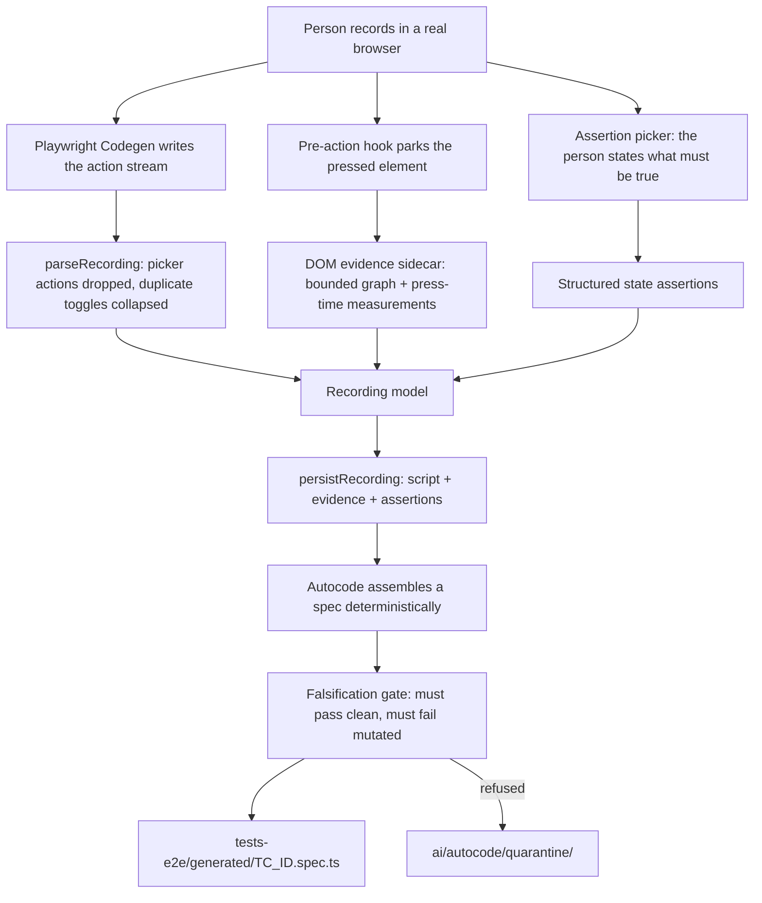

# Recording Guide — from a live browser to a generated spec

The other half of authoring. [FRAMEWORK-GUIDE.md](FRAMEWORK-GUIDE.md) covers writing a case in the
spreadsheet and running it; this covers **recording one in a browser** and the assertion picker,
which until now was documented only in agent context files.

Everything here is verified against the repository. Anything the repository cannot answer is
marked **Needs project-specific value**.

---

## 1. What recording is for

A recording is a second way to author a case, not a second pipeline. It produces the **same**
`CaseDraft` the Add/Edit form produces — same workbook row, same ID scheme, same generator, same
quality gate. The recorded script is an *input*; it is redacted, held for the save that follows,
and discarded once a spec has been assembled from it.

Two things a recording is deliberately not:

- **It is not a test.** Raw Codegen output is never pasted into `tests-e2e/`.
- **It is not an Expected Result.** A row's Expected Result is composed only from assertions the
  person actually recorded. "They clicked Sign In, so they must have expected to be signed in" is
  the invented acceptance criterion this toolkit exists to prevent — a recording with no assertion
  stops with `recorded test has no assertion` rather than being sent to a model.

---

## 2. The recording path



Three artefacts are written per recording, all under `ai/dashboard/recordings/` and all
git-ignored:

| File | What it holds |
| --- | --- |
| `<TC_ID>.spec.ts` | Codegen's raw script, redacted. The action stream. |
| `<TC_ID>.evidence.json` | Bounded DOM graph per target, with press-time measurements. |
| `<TC_ID>.assertions.json` | The structured assertions the person picked. |

The third exists because Codegen never sees the picker: its assertions travel on their own channel
and would otherwise be lost at save time.

---

## 3. Before you record

```bash
npm install
npx playwright install chromium
cp .env.example .env          # fill in the credential placeholders
```

Then start the dashboard:

```bash
npm run excel:dashboard
```

It binds **loopback only**. It tries port `80` at hostname `moolyaautomationreport.com` (a
hosts-file entry mapping that name to `127.0.0.1` — not DNS, not a deployment) and **falls back to
`http://127.0.0.1:4321`** with a message when port 80 is taken. Both are overridable:

```bash
EXCEL_DASHBOARD_HOST=127.0.0.1 EXCEL_DASHBOARD_PORT=4321 npm run excel:dashboard
```

### The live transport

```bash
RECORDER_TRANSPORT=live npm run excel:dashboard
```

`RECORDER_TRANSPORT=live` opts into the transport that records **in a browser this process owns**,
which is what makes DOM evidence and the assertion picker possible. Anything else keeps the
original `playwright codegen` child process, which still records actions but captures no evidence
and offers no picker.

It is **off by default and falls back on every failure** — a missing internal API, a launch
failure, a recorder refusal — so a Playwright upgrade can never make recording unusable.

> `RECORDER_TRANSPORT` is not currently listed in `.env.example`. Set it on the command line, or
> add it to your own `.env`.

**Restart the dashboard after pulling changes.** The server loads its modules once at startup, so
a running instance keeps the code it started with. More than one confusing afternoon has been
spent recording against a server that predated the fix being tested.

---

## 4. Recording a case

1. Open the dashboard and start a recording. A browser opens.
2. **Do what the test should do.** Sign in, navigate, click.
3. **State what must be true** with the assertion picker (below).
4. Close the browser or press Stop.
5. Review what was captured, then Save. Nothing is written until you save.

Passwords are never captured: a sensitive field is stored as the marker `[type=password]`, and the
workbook receives the token `<valid-password>` — resolved from the environment at run time. Those
two strings mean different things and must never be merged.

---

## 5. The assertion picker

The picker is an in-page overlay owned by the recorder. It lives inside a **closed shadow root**
under a single custom element, `ba-aura-assert`.

### Using it

| Action | Result |
| --- | --- |
| Click the **Assert** pill (bottom right) | Enters selection mode; a crosshair veil takes the pointer |
| Click an application element | Selects it; the assertion panel opens |
| **Drag** the pill, or the panel's header | Moves it. Dragging never activates Assert mode |
| Click an assertion | Records it and closes the panel |
| **Close** (×) or **Esc** | Cancels without recording |

The panel shows what the element **is**, what is **true of it right now**, and only the assertions
that element can support:

```
Assert                                   ⠿ drag   ×
Enable Notifications
switch
✓ Visible   ✓ Enabled   ✓ ON
Assert:
[ ON ] [ OFF ] [ Enabled ] [ Disabled ] [ Visible ] [ Hidden ]
```

A checkbox offers Checked/Unchecked; a button offers Enabled/Disabled, Visible/Hidden, Has Text,
Has Attribute, Has Class. Nothing is offered that the capability resolver cannot prove the element
supports, and nothing Playwright cannot express deterministically.

### What it will refuse

- **An attribute whose name could hold a secret** — refused at record time, with the reason, and
  never with the value repeated back.
- **`Visible` on a control the application hides.** Point at a custom switch and the picker
  resolves the *assertion subject* to the checkbox the label controls, while visibility stays bound
  to the element you can actually see. The two are different elements on purpose.

### Why it is invisible to the recording

Playwright's selector generator pierces an **open** shadow root — it would name the pill as
`getByText('Assert')` and a capability row as `getByRole('button', { name: 'ON' })`, neither of
which mentions the recorder. Closed, every interaction retargets to the host and records as
`page.locator('ba-aura-assert')`, which `parseRecording` drops.

Filtering by name instead is unsafe and was measured to be so: a real application button labelled
OFF records identically to the picker's own OFF row. Only the structure separates them.

---

## 6. What the parser normalises

`parseRecording` is where a raw script becomes a recording model. Three things it does that are
worth knowing before you read a generated spec:

- **Picker actions are dropped.** Zero survive.
- **One human toggle stays one action.** Clicking a checkbox's visible label makes Codegen write
  *two* lines — the click on the span, and the resulting `check`/`uncheck` of the input. Replaying
  both applies the toggle twice. Where the evidence proves they are the same control, the **click**
  is kept: the input is often `0×0` and cannot be actioned, and the click is what the person did.
- **Assertion positions are preserved.** The recorded order *is* the test. An assertion made before
  a toggle must not be replayed after it.

---

## 7. From recording to spec

```bash
npm run excel:autocode -- excel/<applicationId>-test-cases.xlsx --dry-run   # what needs code, and why
npm run excel:autocode -- excel/<applicationId>-test-cases.xlsx --ids TC_LOGIN_001
```

A recorded case is assembled **deterministically** — no model is asked — and gets its own file at
`tests-e2e/generated/<TC_ID>.spec.ts`.

Every generated spec is then run **twice**: once as written, and once with its assertions
mechanically broken. It is kept only if it passes the first and **fails** the second. One that
passes both ways is checking nothing, which is the failure that looks exactly like coverage; it
goes to `ai/autocode/quarantine/` and is never registered.

Status becomes `Generated`, never `Automated` — that is earned by a green run of the real suite.

---

## 8. Running what you recorded

```bash
npm run excel:test                          # the whole Excel suite
npm run excel:test -- --grep TC_LOGIN_001   # one case
npm run excel:run -- excel/<applicationId>-test-cases.xlsx   # workbook drives it, results written back
```

A bare `npx playwright test` runs the **upstream MCP suite**, not this one, and will report
`No tests found` for anything in `tests-e2e/`.

---

## 9. Troubleshooting the recorder

Every row below is a real failure mode with a check you can run.

| Symptom | Likely cause | Check / fix |
| --- | --- | --- |
| **Browser does not open after Record** | Playwright browsers not installed | `npx playwright install chromium` |
| | Dashboard started before the browsers were installed | Restart the dashboard |
| | The live transport failed and fell back | Look for `live recorder unavailable` in the terminal |
| **Browser opens but nothing is captured** | The transport is `codegen`, not `live` | The run log prints the transport; restart with `RECORDER_TRANSPORT=live` |
| **Assert pill is not visible** | Live transport not active | Look for `[recorder] assertion picker ready`. **If that line is absent, the picker is not there** and no amount of clicking will produce an assertion |
| | The pill was dragged off-screen | It clamps to the viewport; reload the page under test |
| **Dashboard will not start — port in use** | Another dashboard is already running | `netstat -ano \| findstr :80` then stop it, or set `EXCEL_DASHBOARD_PORT=4321` |
| **Two dashboards running at once** | A previous one was never stopped | **Stop one.** Both can write `mapping.json`, `state.json` and the workbook; concurrent writes clobber each other |
| **`another run is in progress`** | Stale `ai/autocode/.lock` from a killed run | The lock records a PID. If that process is dead, delete `ai/autocode/.lock` |
| **Sign-in fails during recording** | `.env` missing or wrong | `.env` is git-ignored; copy `.env.example` and fill it in. Use a dedicated QA account |
| **Dashboard will not save the case** | Workbook open in Excel | Excel locks the file. Close it — nothing was written |
| **Recording saved but nothing generated** | No assertion was picked | The pipeline stops with `the recording contains no assertion`. Re-record with an assertion |
| **Changes to the code seem to have no effect** | The server loads its modules once at startup | **Restart the dashboard after pulling or editing** |

### Verifying the live recorder in one look

```bash
RECORDER_TRANSPORT=live npm run excel:dashboard
```

Then start any recording and watch the terminal for:

```
[recorder] assertion picker ready
```

That line is printed when — and only when — the picker was installed. It is currently the
only way to confirm the live transport is active without reproducing a whole session.

---

## 10. When a recording will not generate

| Symptom | What it means |
| --- | --- |
| `the recording contains no assertion` | Nothing was picked. Confirm the row or re-record. |
| A step reads `NEEDS_REVIEW` | The locator measured more than one element and nothing proven could replace it. A person has to say which one — `first()`/`nth()` are never added. |
| The spec is in `quarantine/` | It passed with its assertions broken, so it was asserting nothing. |
| Nothing recorded at all | The live transport fell back to codegen. Check the run log for `live recorder unavailable`. |

The run log prints `[recorder] assertion picker ready` when the picker is installed. If that line
is absent, the picker is not there and no amount of clicking will produce an assertion.

---

## 11. What is generated at run time, and never committed

All git-ignored:

```
ai/dashboard/recordings/     recordings, evidence, assertions
ai/dashboard/runs/           per-run evidence and HTML reports (~3 MB/run with traces)
ai/autocode/quarantine/      specs the gate refused
ai/reports/                  execution reports, metrics, step evidence
test-results-excel/          Playwright output for the Excel suite
reports/                     Allure and HTML reports
.env                         your credentials
```

`ai/test-mapping/mapping.json` and `ai/autocode/state.json` **are** written by the tooling and are
part of the working state — do not hand-edit them, and be aware that a dashboard run will change
them underneath you.

---

## 12. Related documents

| Document | For |
| --- | --- |
| [FRAMEWORK-GUIDE.md](FRAMEWORK-GUIDE.md) | Setup, authoring from the spreadsheet, running, maintenance |
| [EXCEL-AUTOMATION.md](EXCEL-AUTOMATION.md) | Command reference, dashboard, data-driven rows |
| [ABSTRACTION-GUIDE.md](ABSTRACTION-GUIDE.md) | How a recorded locator becomes a reusable Page Object method |

## 10. What your recording becomes

```
Dashboard Recording
      ↓  press-time evidence (matchCount, identity, document, measuredAt)
Authoring (workbook row)
      ↓
Existing Page Object reuse            ← deterministic, no model
      ↓  by name, by proven locator, then by parameterised template
      ↓  nothing matched
Deterministic abstraction             ← classify · validate · name · parameterise
      ↓  PROPOSED                          ↓  NEEDS_REVIEW, semantic reason only
      │                            Semantic AI fallback   ← ONE question, closed answers
      │                                    ↓
      │                            Deterministic re-validation  ← every other rule, again
      └──────────────→ Page Object method ←┘
                             ↓
                       Knowledge YAML entry
                             ↓
                 future recordings REUSE it   ← deterministic, no model
```

**Why the press-time evidence you captured matters here.** A locator can only become a
reusable Page Object method if the recorder measured it *at the moment you pressed*, found
exactly one element, in that same document, and proved that element was the one you acted
on. Without all four, the capability stays `NEEDS_REVIEW` — and no model is allowed to
supply what the measurement did not. That is why a recording made before press-time capture
existed cannot be abstracted: re-record it, or leave it.

A model is asked at most one question per capability, only about **meaning** (ownership,
naming, whether one reusable thing is being described), and only when no safety refusal is
present. It never chooses your locator.
| [CLAUDE.md](CLAUDE.md) | Project rules and invariants |
| [ai/CLAUDE.md](ai/CLAUDE.md) | Why the generation pipeline is built the way it is |
