# MoolyaAura
## Automation Intelligence Platform — End-User Guide

**Recording → Mapping → Generation → Validation → Execution → Quarantine → Promotion**

---

**Document status**

| | |
| --- | --- |
| Product | MoolyaAura Automation Intelligence Platform |
| Dashboard API version | **v11** (shown in the sidebar footer) |
| Documented against | The live dashboard on this machine (loopback only) |
| Captured | 2026-09-14, Chromium, 1440 × 900 |
| Audience | Manual Testers · Automation Engineers · QA Leads · Client evaluators |
| Screenshots | All images are real captures of the running product. None are mock-ups. |

Every screenshot in this guide was taken from the running application. Where a capability
exists in the engine but is **not** surfaced in the dashboard, the guide says so rather than
implying a button that is not there.

---

## Table of contents

1. MoolyaAura Overview
2. Starting MoolyaAura
3. Application and Execution Configuration
4. Test Data
5. Test Case Selection
6. Recording
7. Recording Review
8. Page Objects
9. Generation
10. Validation
11. Execution
12. Results
13. Quarantine
14. Quarantine Execution Basis
15. Legacy Quarantine Cases
16. Eligibility
17. Promotion
18. Code Workspace
19. Browser and Environment Behaviour
20. Error and Troubleshooting Guide
21. Recommended Tester Workflow
22. End-to-End Example

---

# 1. MoolyaAura Overview

## What is MoolyaAura?

MoolyaAura turns **what a tester does in a browser** into **maintainable Playwright
automation**, and then proves that the automation is actually worth keeping.

You record a test the way you would demonstrate it to a colleague. MoolyaAura watches the real
browser, works out which screen and which reusable component each action belongs to, writes
the test code, and then runs that code twice — once as written, and once with its assertions
deliberately broken. A test only enters the suite if it passes the first run and **fails** the
second.

## What problem does it solve?

Most automation suites rot quietly. Two failures cause it:

- **Locators drift.** Someone renames a button and forty tests break in forty places.
  MoolyaAura keeps element knowledge in reusable **Page Objects**, so the change is made once.
- **Tests stop checking anything.** A test that passes but asserts nothing looks exactly like
  coverage on every dashboard. This is the more dangerous failure, and it is invisible.
  MoolyaAura's **assertion mutation** step exists solely to catch it.

It also keeps every application's work separate. Page Objects, knowledge, recordings, test
data and results all belong to one declared application and are never borrowed across
applications.

## The workflow

```
   Test Case  (a row in your Excel workbook)
        |
   Test Data  (which user / which data this run uses)
        |
     Record   (a real browser; MoolyaAura watches)
        |
 Recording Review   (confirm: which Page? which Page Object?)
        |
  Page / Page Object Mapping
        |
    Generate   (MoolyaAura writes the Playwright test)
        |
  Clean Validation   -- must PASS
        |
 Assertion Mutation  -- must FAIL
        |
        +-----------------+
        |                 |
    ACCEPTED          QUARANTINE
        |                 |
        |          Review / Rerun
        |                 |
        |            ELIGIBLE
        |                 |
        +-----> PROMOTE <-+     (always an explicit human action)
```

Nothing on that path happens silently. Generation does not promote. A green run does not
promote. Eligibility does not promote. **A person promotes.**

---

# 2. Starting MoolyaAura

**What is this?** The dashboard is the single place you work from. It is a local control
panel: it binds to loopback only and is not a public web service.

**How do I open it?** Your team will give you the address — typically a friendly hostname that
maps to `127.0.0.1`, or `http://127.0.0.1:4321`. Open it in Chrome or Edge.

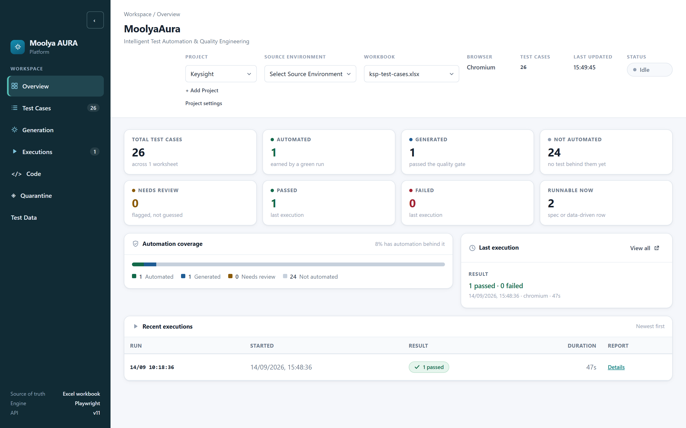

***Figure 1 — The Overview screen, the first thing you see.***

**What you are looking at:**

- **Left sidebar** — the seven areas of the product: Overview, Test Cases, Generation,
  Executions, Code, Quarantine, Test Data. The badges show live counts (here, 26 test cases
  and 1 execution).
- **Header strip** — Project, Source Environment, Workbook, plus read-only Browser, Test
  Cases, Last Updated and **Status** (here, `Idle`).
- **Coverage cards** — Total, Automated, Generated, Not automated, Needs review, Passed,
  Failed and Runnable now.
- **Sidebar footer** — *Source of truth: Excel workbook · Engine: Playwright · API v11.* This
  is the quickest way to confirm which build you are on.

**What should I expect?** On a fresh start the Status reads `Idle` and Source Environment reads
**"Select Source Environment"**. That is deliberate — see §3.

---

# 3. Application and Execution Configuration

This chapter is the one most worth reading carefully, because three different ideas have
similar names.

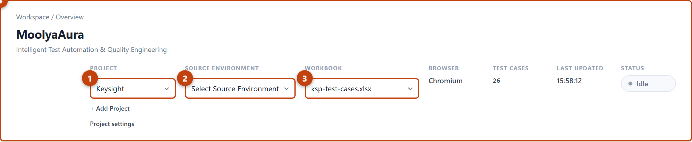

***Figure 2 — Header configuration. 1 Project · 2 Source Environment · 3 Workbook · 4 read-only run context (Browser, Test Cases, Last Updated, Status).***

## Application vs Target vs Source — they are not the same

| Term | Where it is | What it means |
| --- | --- | --- |
| **Application (Project)** | Header, `Project` | *Whose* test this is. Everything — Page Objects, knowledge, recordings, results — is filed under this. It is declared, permanent, and never guessed from a URL. |
| **Source Environment** | Header, `Source Environment` | The environment the recording was **made against**. It tells MoolyaAura how to read the URLs that were recorded. |
| **Target Environment** | Test Cases tab → *Execution environments* | The environment the test will **run against** now. |

The product states this itself, under the environment checkboxes:

> *Targets run sequentially. The Source Environment in the header identifies recorded URLs;
> generation verification uses one selected target.*

**Why they are separate:** you record once against staging and then run the same test against
staging, QA, or both. MoolyaAura rebases the recorded URLs from the source environment onto
the target environment. If source and target are the same, nothing is rebased.

**Why Source Environment starts empty:** when an application has more than one environment and
no configured default, MoolyaAura refuses to guess. An unselected source is a question, not a
default — see `SOURCE_ENVIRONMENT_CONFIGURATION_FAILURE` in §20.

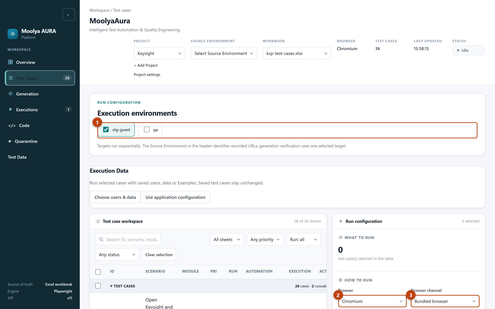

***Figure 3 — Test Cases tab. 1 Execution environments (targets) · 2 Browser · 3 Browser channel. Headed/Headless sits just below in the same panel.***

## Choosing how it runs

In the **Run configuration** panel on the Test Cases tab:

- **Browser** — Chromium, Firefox or WebKit.
- **Browser channel** — *Bundled browser* (ships with MoolyaAura), *Installed Chrome*, or
  *Installed Edge*.
- **Parallel workers** — how many cases run at once.
- **Evidence to capture** — Screenshot, Video and Trace, each *On failure / Always / Never*.
- **Headed** — *"Watch the browser as it runs."* Unticked means headless.
- **Write results into the workbook** — *"After a timestamped backup."*

## Locator timeout: 40 seconds

Every wait for an element shares **one 40-second maximum**.

**This is a maximum, not a sleep.** If the element is there in 200 ms, the step continues in
200 ms. The 40 seconds is the point at which MoolyaAura stops waiting and reports *why* it
stopped. A step that resolves at 9.4 seconds costs 9.4 seconds.

The value is fixed framework policy and is **not editable in the dashboard**. It is recorded on
every step in the diagnostics so you can always see which budget applied.

---

# 4. Test Data

**What is this?** Test Data holds the *users* and *values* your tests run with, kept separately
from the tests themselves.

**Why?** So one test can run as three different users without writing three tests — and so no
password ever lives in a spreadsheet, a recording or generated code.

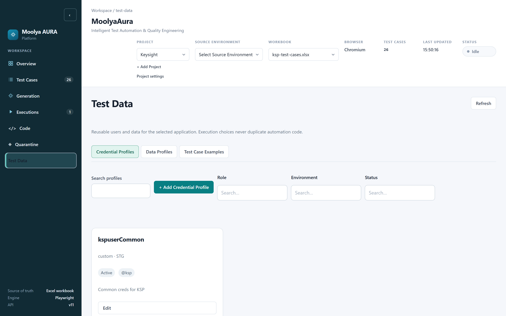

***Figure 4 — Test Data, showing the three tabs and the Credential Profiles list.***

There are exactly three tabs: **Credential Profiles**, **Data Profiles**, **Test Case Examples**.

## 4.1 Credential Profiles

A Credential Profile is a named login — for example `kspuserCommon` — with a username and
password **per environment**.

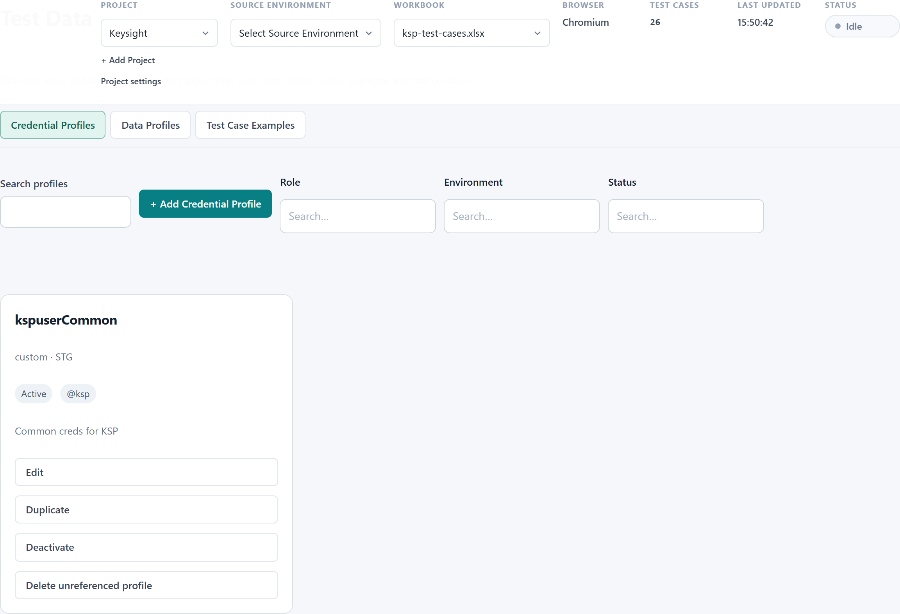

***Figure 5 — The Credential Profiles list. Values are never shown; only whether they are configured.***

The list shows the profile name, role, tags, whether it is Active, and which environments it
covers. Actions are **Edit**, **Duplicate**, **Deactivate** and **Delete unreferenced
profile**. A profile that a test refers to cannot be deleted.

### Adding a Credential Profile

Click **+ Add Credential Profile**.

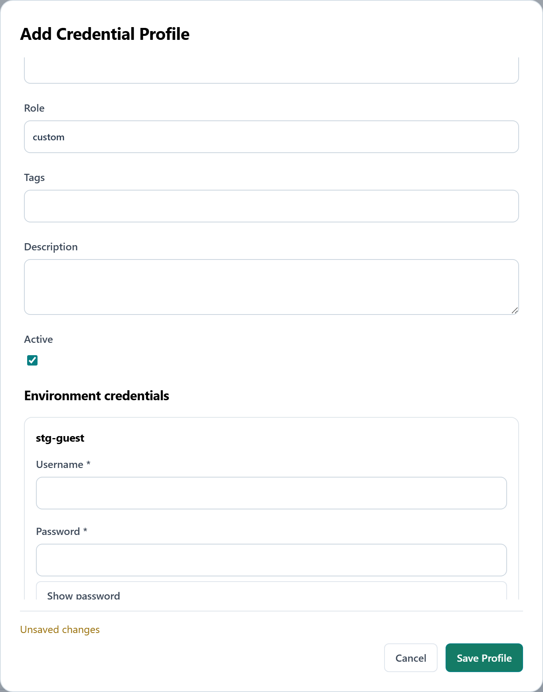

***Figure 6 — Add Credential Profile, with an environment added. The password field is masked and empty; nothing was saved to capture this.***

| Field | Notes |
| --- | --- |
| Profile name * | How you will pick it later, e.g. `kspuserCommon` |
| Role | Free text, e.g. `custom`, `admin` |
| Tags | For filtering |
| Description | Optional |
| Active | Inactive profiles cannot be selected for a run |
| Environment credentials | Add one block per environment, each with **Username \*** and **Password \*** |

**Security, in plain terms:**

- The password box is masked. A **Show password** toggle exists for when you are typing it.
- On save, the password is encrypted with Windows DPAPI for the current user. There is no key
  file and no plaintext fallback.
- After saving, the UI only ever reports *"Password configured"*. The value is never sent back
  to the browser, never written to a report, and never appears in a recording or a generated
  test.
- **Nothing is saved until you click Save Profile.**

## 4.2 Data Profiles

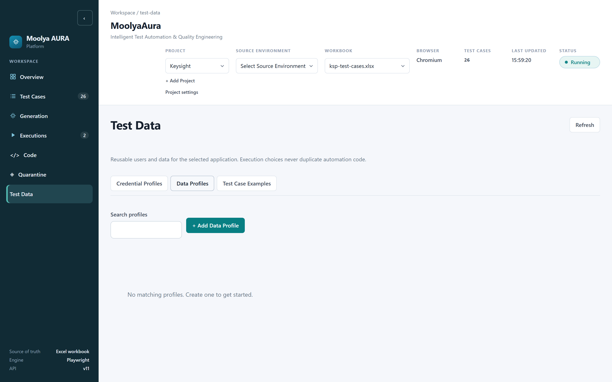

***Figure 7 — Data Profiles.***

A Data Profile is a named set of non-secret values — a search term, a product code, a
quantity. Credential-shaped keys are deliberately **refused** here: try to create a field
called `password`, `username`, `email`, `token`, `secret`, `cookie` or `authorization` and the
store rejects it with *"Use Credential Profiles for credentials."* Secrets have exactly one
home.

## 4.3 Test Case Examples

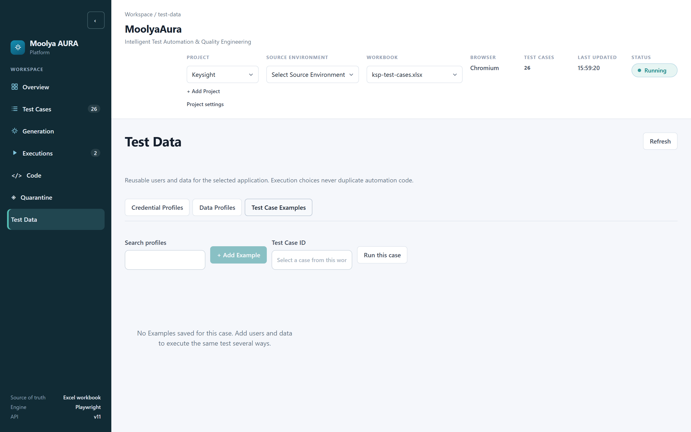

***Figure 8 — Test Case Examples.***

An Example is a saved pairing of a test case with a credential profile and/or data profile, so
a combination you run often can be re-selected in one click instead of rebuilt each time.

## The execution instance

This is the mental model worth keeping:

```
   Test Case  +  Execution Data Profile  +  Environment  =  Execution Instance
```

One test case, three credential profiles and two target environments is **six execution
instances** — six independent browser sessions, six sets of results. The test case itself is
written once and never edited to accommodate them.

On the Test Cases tab, **Choose users & data** opens the selector; **Use application
configuration** falls back to the application's own configured credentials with no explicit
profile.

---

# 5. Test Case Selection

**Where do test cases come from?** The Excel workbook named in the header — the sidebar footer
states *Source of truth: Excel workbook*. MoolyaAura reads it; it does not invent cases.

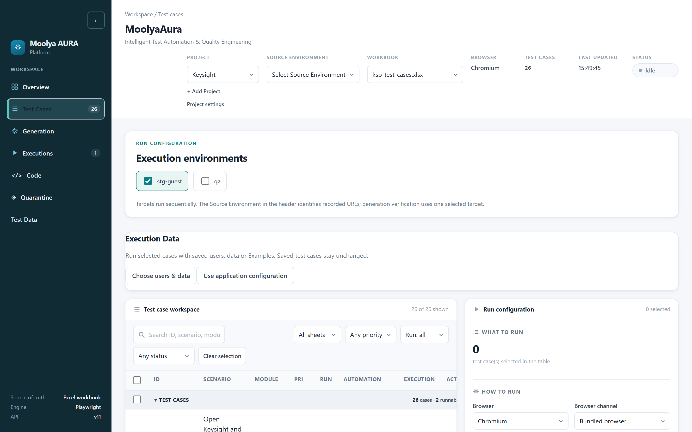

***Figure 9 — The Test case workspace.***

The table columns are **ID · Scenario · Module · Pri · Run · Automation · Execution ·
Actions**, with filters for worksheet, priority, the workbook's **Run** column, and automation
status, plus a free-text search.

## Lifecycle states you will actually see

These are the states the product shows. There are no others.

| Automation status | Meaning |
| --- | --- |
| **Not automated** | No test behind this row yet |
| **Generated** | A test exists and passed the quality gate |
| **Automated** | Earned by a green run — never set by hand |
| **Needs review** | Flagged for a human decision, not guessed |

| Execution status | Meaning |
| --- | --- |
| **Passed / Failed** | From the last execution |
| **Runnable now** | A spec or data-driven row exists, so it can run |

**Important:** *Generated* is not *Automated*. Generation means the code exists and survived
the gate. *Automated* is earned later by a genuine green run and is promoted from results — it
is never typed in.

---

# 6. Recording

**What is this?** MoolyaAura opens a real browser and watches you use the application.

**When do I use it?** When a test case has no automation behind it, or when the flow has
changed enough that the old recording no longer describes it.

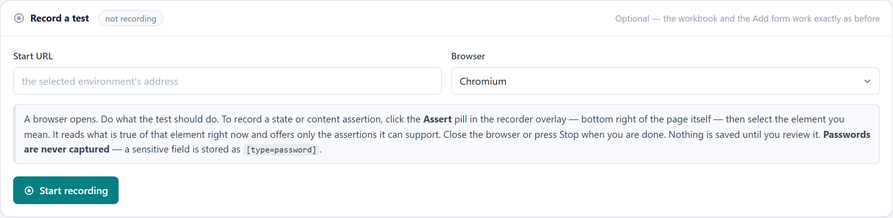

***Figure 10 — The Record a test panel on the Test Cases tab.***

**How do I use it?**

1. Set the **Start URL** (optional — it can come from the workbook).
2. Choose the **Browser**: Chromium, Firefox or WebKit.
3. Click **Start recording**. A browser window opens.
4. **Do what the test should do.** Click, type, navigate, exactly as a user would.
5. To check something, use the **Assert** pill in the recorder overlay at the bottom-right of
   the page, then select the element you mean. MoolyaAura reads what is currently true of that
   element and offers only the assertions it can actually support — it will not offer you an
   assertion it cannot prove.
6. Close the browser or press **Stop**.

**What should I expect?** The product states it plainly in the panel:

> *Nothing is saved until you review it.*

You land in Recording Review (§7) with the actions and assertions listed. Nothing has been
written to your application's knowledge yet.

## What MoolyaAura records

- the **actions** you performed and their order;
- the **assertions** you explicitly added;
- **evidence** about each target element — its role, accessible name, stable attributes, the
  document it lived in — captured at the moment you interacted with it;
- **navigation** and why it happened, so a redirect is never replayed as if you had typed it;
- masked screenshots of the steps.

## Credential recording security

The recorder panel states:

> *Passwords are never captured — a sensitive field is stored as `[type=password]`.*

In the current engine the protection is broader than that sentence suggests. A typed value is
protected because of **where it came from**, not because of what the field was called:

- If the value **is** the username/email of the selected Credential Profile, or of the
  application's configured credentials, it is replaced and recorded as `appCredentials.email`.
- If it **is** the password, it is replaced and recorded as `appCredentials.password`.
- A field whose *label* looks secret (`password`, `secret`, `token`, `otp`, `cvv`, card
  numbers) is still protected as a second line of defence.
- An ordinary business field — *"Customer contact email"* holding a normal test value — is
  **not** redacted. It is data, and you need it.

The generated test therefore contains `appCredentials.email`, never a literal address.

> **Known documentation gap.** The panel copy mentions passwords only; identifier protection is
> not yet described in the UI text. The behaviour is as above.

---

# 7. Recording Review

This is where you turn *"I clicked that thing"* into *"that thing is the Log In link on the
Home page."* It is the most important screen in the product, and the only one where your
judgement is required.

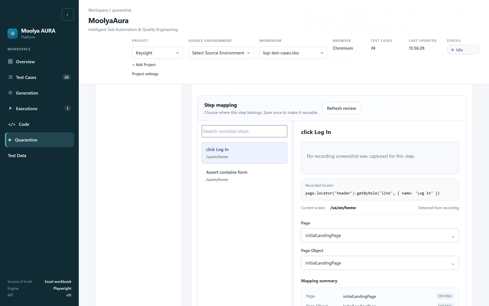

***Figure 11 — Recording Review: recorded steps on the left, the selected step's mapping on the right.***

## The shape of the screen

- **Left** — every recorded step, with the screen it happened on.
- **Right** — the selected step: its **Recorded locator**, the **Current screen** (labelled
  *Detected from recording*), and the two decisions you make.

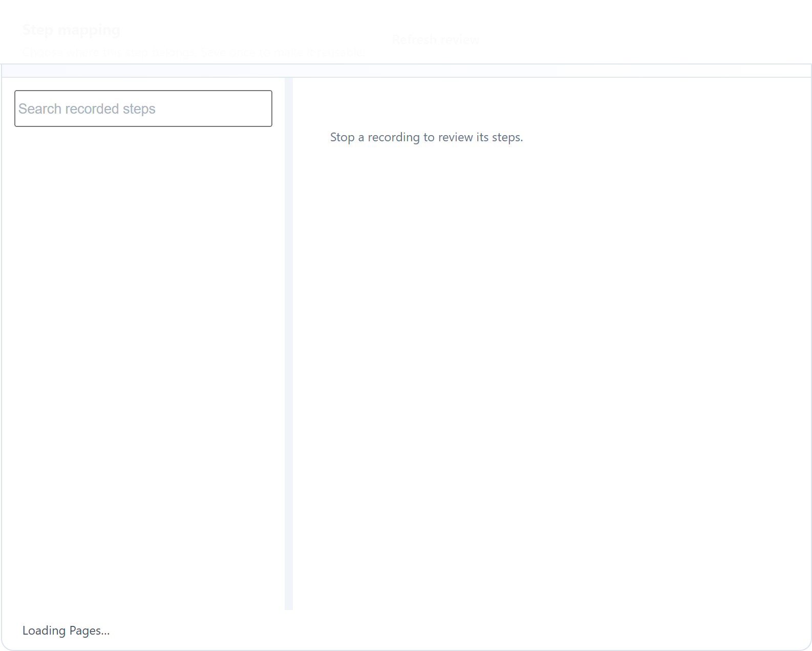

***Figure 12 — The recorded step list.***

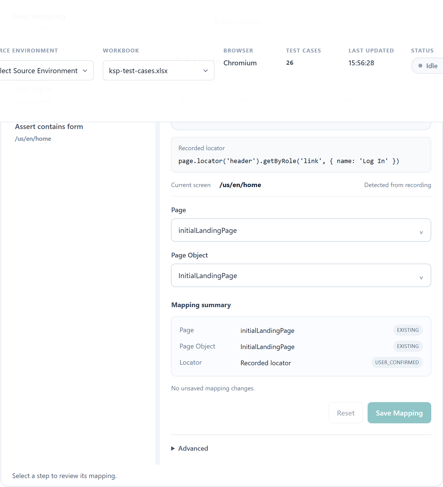

***Figure 13 — A selected step, showing its recorded locator and detected screen.***

## The three-step loop

```
   Recorded Step  ->  Page  ->  Page Object  ->  Save Mapping
```

You do this once per step that needs it. After **Save Mapping**, the decision is reusable — the
next recording that touches the same control already knows the answer.

### Choosing the Page

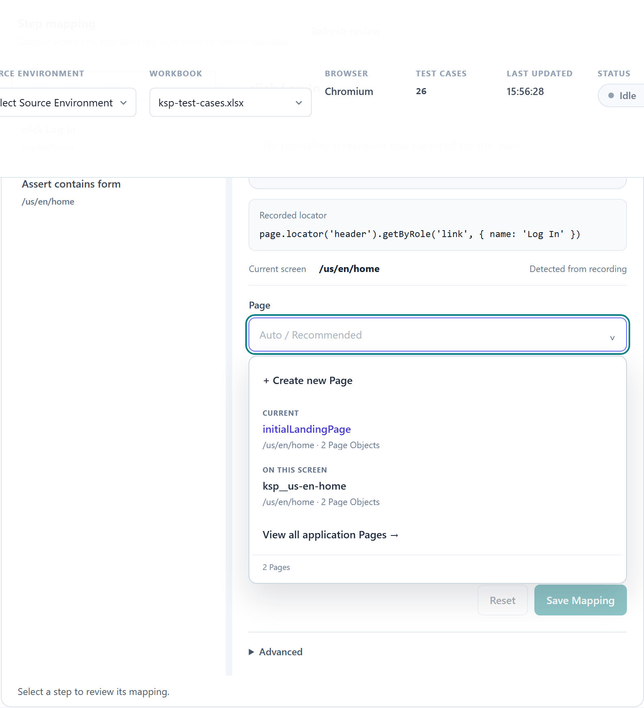

***Figure 14 — The Page selector: Create new Page, the current Page, Pages on this screen, and the full list.***

The Page combobox is searchable and groups its suggestions:

- **+ Create new Page** — name it and it exists. A name is all that is required.
- **CURRENT** — the Page already associated with this step.
- **ON THIS SCREEN** — Pages MoolyaAura knows live on this route.
- **View all application Pages →** — everything in this application.

### Route is context, not identity

This trips people up, so it is worth stating directly:

> **A logical Page is identified by Application + Page name. The route is context only.**

Consequences you can rely on:

- **Several Pages may share one route.** A header, a search panel and a results grid can all
  live on `/us/en/home` as three separate Pages, because they are three separate things.
- **A Page may have no route at all.** A header that appears everywhere is not "on" any one
  screen.
- Renaming a route does not orphan your Page Objects.

### Choosing the Page Object

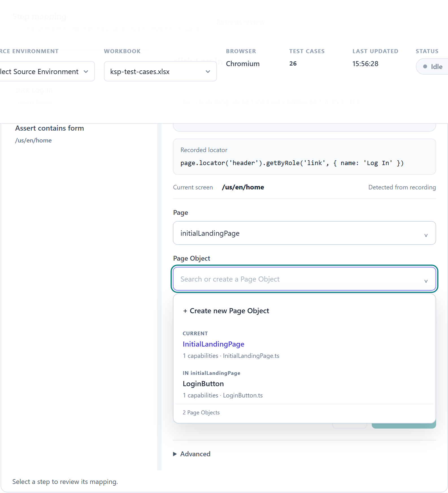

***Figure 15 — The Page Object selector, with Create and existing Page Objects.***

Same pattern: search, pick an existing Page Object, or create one. A Page Object is the class
that owns the actual locator method.

### Save Mapping, Reset, Advanced

- **Save Mapping** — commits Page + Page Object for this step. Knowledge, Page Object source
  and fixture registration are written **together or not at all**; a half-applied mapping is
  not a state MoolyaAura can be left in.
- **Reset** — discards your unsaved choices for this step and returns it to *Auto /
  Recommended*.
- **Advanced** — per-step options including using the recorded locator directly instead of a
  Page Object method. What you choose here is marked as **user-authored and not
  framework-validated**, and it is honest about that.

**What can go wrong?** If MoolyaAura cannot establish ownership of an element, it will not
invent a Page. It emits the recorded locator and reports that a Page Object is required. That
is a request for your decision, not a failure.

---

# 8. Page Objects

**What is a Page Object, in plain language?** One place that knows how to find one thing.
`InitialLandingPage.logIn()` knows how to find the Log In link. Fifty tests can use it; when
the link changes, you change it once.

## Reuse before creation

MoolyaAura always tries, in this order:

1. **Reuse an existing capability** — the method already exists and provably points at this
   element.
2. **Reuse a parameterised capability** — a method that takes an argument, matched on its
   template.
3. **Create a new capability** — only when deterministic evidence supports it.

In the generation log you will see this stated per element, for example:

```
      PAGE OBJECT LIFECYCLE (2 element(s)):
          2  EXISTING_PO_REUSED
  page objects: 2 reused, 0 created deterministically, 0 created by resolver, 0 refused
```

Read that as: *two elements, both already had a Page Object method, nothing new was invented.*
That is the healthy outcome.

## What the labels mean

| Label | Meaning |
| --- | --- |
| **EXISTING_PO_REUSED** | An existing method was proven to be this element and was reused |
| **USER_CONFIRMED** | *You* chose this binding in Recording Review; automatic inference was not used |
| Created deterministically | A new method, written from measured evidence |
| Created by resolver | A new method that needed the AI last-mile step |
| **Refused** | MoolyaAura would not claim the element — it goes to review |

**Why "refused" is a good outcome:** a match on a *name* is not proof of identity. MoolyaAura
confirms identity by resolving the candidate method in the same document and comparing the
element it finds with the element you actually acted on. If it cannot prove they are the same,
it says so instead of guessing. An unknown is never recorded as a yes.

---

# 9. Generation

**What is this?** Generation turns the reviewed recording into a Playwright test file.

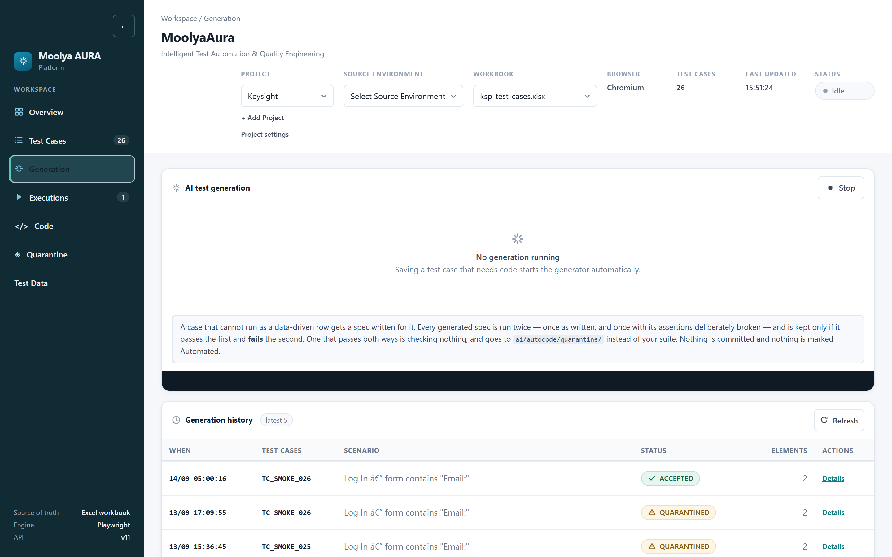

***Figure 16 — The Generation tab: live log and generation history.***

**How do I use it?** Select the case and start generation. The log streams live. Each run ends
in the history list, and **Details** reopens the full log of any past run.

## Reading the log

A real, complete generation log looks like this:

```
=== TC_SMOKE_026 (new) Log In — form contains "Email:"
  writing tests-e2e/generated/ksp/TC_SMOKE_026.spec.ts
  recorded pipeline: assembled from 2 recorded action(s) and 1 assertion(s) in the
  recorded order, reusing 2 Page Object method(s)
      ok   navigate event 0                   explicit recorded navigation intent
      ok   click Log In                       reused InitialLandingPage.logIn() -
                                              USER_CONFIRMED authoring binding
      ok   assert contains form               asserted through SsoauthLoginPage.formState()
      PAGE OBJECT LIFECYCLE (2 element(s)):
          2  EXISTING_PO_REUSED
  page objects: 2 reused, 0 created deterministically, 0 created by resolver, 0 refused
  clean run: TC_SMOKE_026
  mutated run (1 mutation type(s)): TC_SMOKE_026
  ACCEPTED: Passed as written and failed with its assertions broken.
```

Line by line: what was assembled, which steps mapped and how, what happened to each element,
then the two validation runs and the verdict.

## Verdicts

| Verdict | Meaning |
| --- | --- |
| **ACCEPTED** | Passed clean **and** failed under mutation. The spec is kept. |
| **QUARANTINED** | Something did not hold. The spec is set aside with its evidence — see §13. |
| **DECLINED** | The generator would not write this case and recorded what it needs. |

## Generation history

The dashboard keeps the **latest five generation runs**. Each record holds the captured log,
the per-case verdicts and the per-element Page Object decisions for that run. Older runs are
pruned; the quarantine packages they produced are *not*.

---

# 10. Validation

This is the idea that makes MoolyaAura different from a recorder, so it is worth a page.

## Why a passing test is not enough

A test that passes proves the code ran. It does **not** prove the test looked at anything. A
test asserting nothing at all passes every time, on every build, forever — and on your
dashboard it is indistinguishable from real coverage.

So MoolyaAura runs every generated test twice:

```
   Generated test
        |
   Clean execution  ------> must PASS   ("it works")
        |
   Assertion mutation
   (expected values deliberately broken)
        |
   Mutated execution ------> must FAIL  ("it was actually looking")
        |
   Validation proven
```

- Passes clean, fails mutated → **accepted**. It works *and* it checks something.
- Passes clean, **passes mutated** → rejected. This is the false positive the gate exists to
  catch.
- Fails clean → rejected. Broken rather than dishonest, but still not ready.

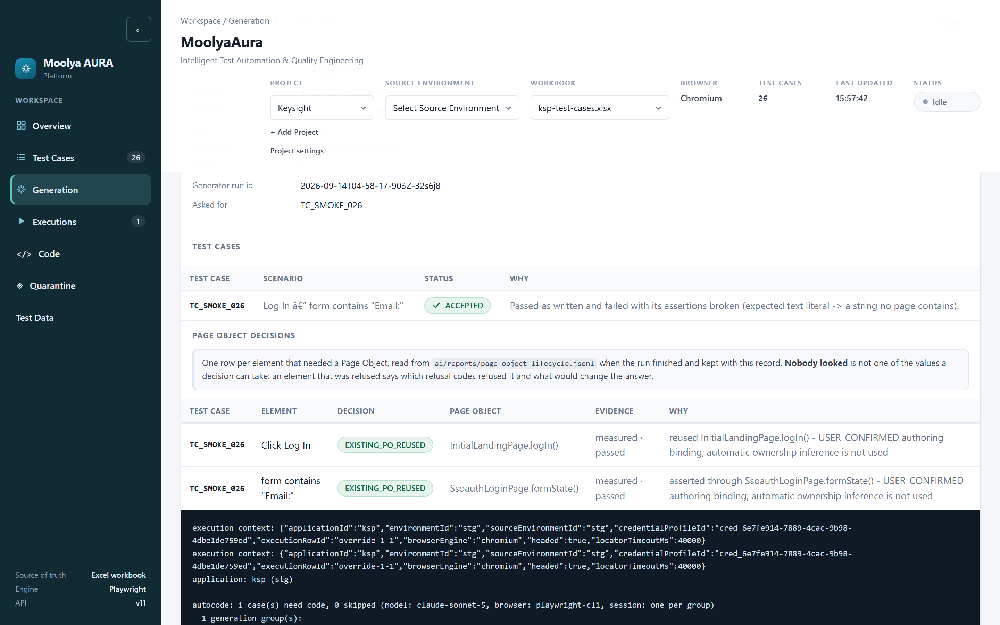

***Figure 17 — A generation record. The log shows the clean run, the mutated run and the verdict.***

**A worked example.** During validation of TC_SMOKE_021 the clean run's final assertion passed
in 9.5 seconds. The mutated run — same test, expected text replaced with a string no page
contains — *found the heading*, compared its content and failed after consuming the full
40-second budget. That is the assertion demonstrably inspecting the application.

**What MoolyaAura will never do:** heal an assertion mismatch into a pass. If an assertion
disagrees with the application, that is a finding about the application, not something to
smooth over.

---

# 11. Execution

**What is this?** Running tests that already exist, as opposed to generating new ones.

**How do I use it?**

1. Tick the test cases in the table (**What to run** shows the count).
2. Tick one or more **Execution environments** — targets run sequentially.
3. Set **How to run**: browser, channel, workers, Headed.
4. Choose **Evidence to capture**.
5. Optionally **Choose users & data**.
6. Click **Run selected**. **Stop** is available while it runs.

## The execution context, in plain terms

Every run carries one bundle of decisions. You will see it echoed in logs and diagnostics:

| Field | Plain meaning |
| --- | --- |
| Application | Whose test this is |
| Target environment | Where it runs now |
| Source environment | Which environment the recording came from |
| Credential profile | Which user — referenced **by ID**, never by value |
| Data profile | Which data values |
| Browser engine / channel | Chromium/Firefox/WebKit; bundled or installed |
| Headed | Whether you watch the browser |
| Locator timeout | Always 40000 ms |

No secret value is ever part of this bundle — only the profile's identifier.

## Headed vs Headless

- **Headless** (default) — no window. Faster, and fine for most runs.
- **Headed** — *"Watch the browser as it runs."* Use it when diagnosing, demonstrating, or when
  the environment requires it (§19).

---

# 12. Results

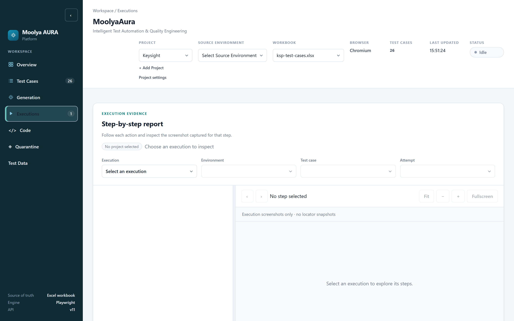

***Figure 18 — The Executions list.***

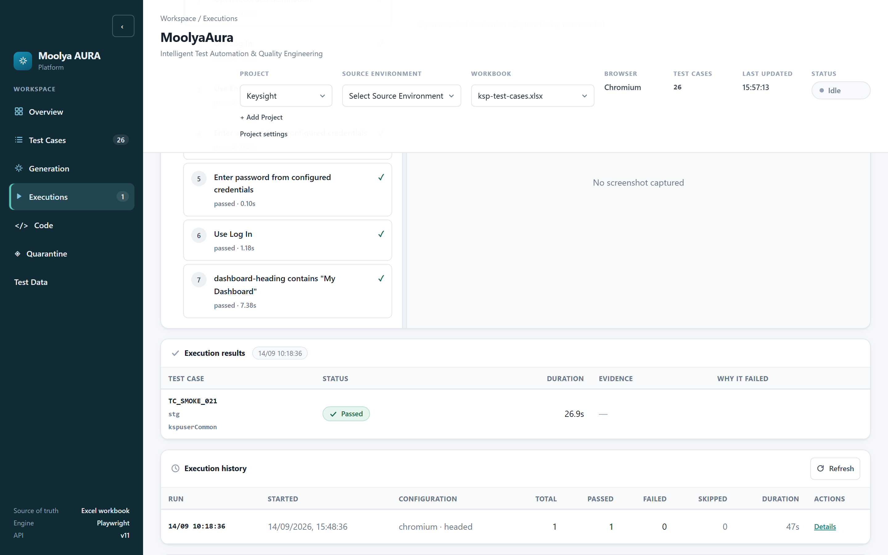

***Figure 19 — An execution's detail, with per-case results.***

For each run you can see the result (passed / failed counts), when it started, its duration,
browser, and a link to the report. Within a run, each **execution instance** is listed
separately with its own profile and environment, so two users running the same case are two
rows, not one averaged row.

Per case you get: pass/fail, per-step outcomes with durations, the error if it failed,
screenshots, video and trace where you asked for them, and the locator timeout that applied.

**One deliberate behaviour worth knowing:** MoolyaAura refuses to attribute a stale results
file to a run that produced none. A crashed run reports **zero** results — never the previous
run's numbers.

---

# 13. Quarantine

**What is this?** Quarantine is where a test goes when it did not earn its place. It is a
workspace, not a bin: the failing code, its dependencies and all its evidence are kept together
so you can find out why.

**Why does a case get quarantined?** It failed the clean run, or it passed the mutation run
(asserting nothing), or it failed a static check, or its configuration was refused before it
could run.

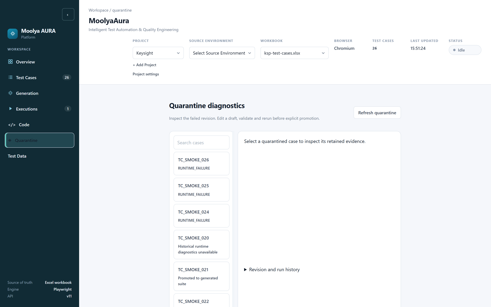

***Figure 20 — The Quarantine list, with each case's reason.***

The list shows each case and why it is there — `RUNTIME_FAILURE`, *Historical runtime
diagnostics unavailable*, or *Promoted to generated suite* for one already resolved.

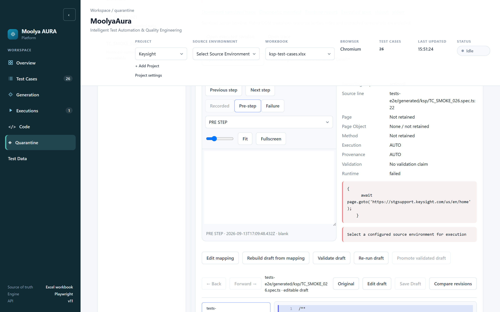

***Figure 21 — The quarantine workspace for a selected case.***

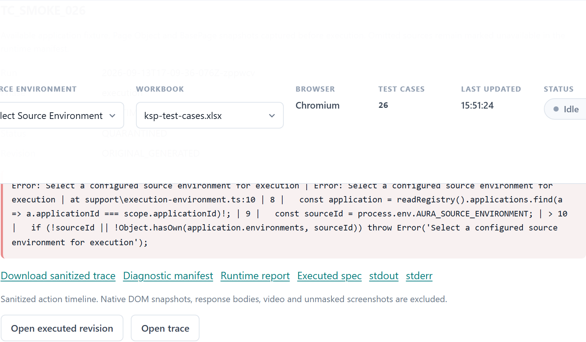

***Figure 22 — The retained failure summary: the actual error, not a paraphrase.***

## What you can do here

| Control | What it does |
| --- | --- |
| **Edit mapping** | Reopen Recording Review for this case (§7) |
| **Rebuild draft from mapping** | Regenerate the draft using the saved mapping |
| **Validate draft** | Static and TypeScript checks — no browser |
| **Re-run draft** | Execute the draft again (§14) |
| **Promote validated draft** | Publish it — only when eligible (§17) |

## Evidence

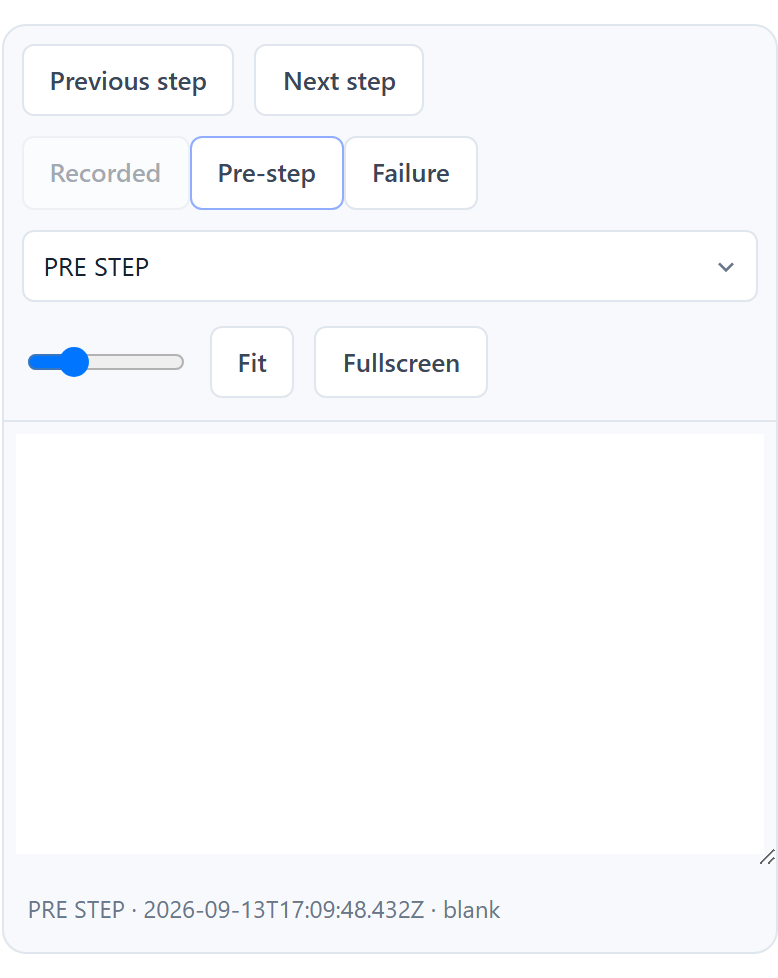

***Figure 23 — Screenshot viewer with step navigation, zoom, Fit and Fullscreen.***

Select any step to see what the screen looked like. **PRE_STEP** is the state immediately
before the step; **FAILURE** is the state when it failed; **Recorded** is what the original
recording saw. Previous/Next step move through the run; the slider zooms; **Fit** returns to
100%; **Fullscreen** fills the screen. A sanitized trace is downloadable where one was
retained.

Where an image was never captured, MoolyaAura says so — *"No recording screenshot was captured
for this step"* — rather than showing a substitute.

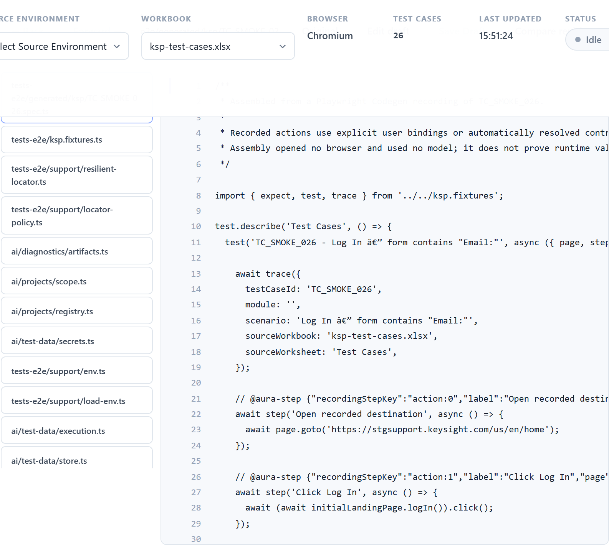

***Figure 24 — The retained source, with the dependency list.***

The exact executed code is kept. Click a symbol to jump to its definition; **← Back** and
**Forward →** move through where you have been. **Edit draft** makes an editable copy; **Save
Draft** validates before saving and keeps your text if it is rejected; **Compare revisions**
diffs the draft against the original.

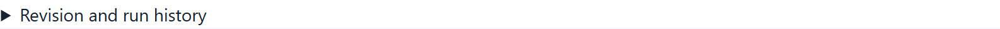

***Figure 25 — Revision and run history.***

Every attempt is retained. Selecting an old run reopens exactly the revision that ran.

> **The original is immutable.** Editing a draft, re-running it, refreshing dependencies and
> promoting all leave the original package byte-for-byte unchanged. It is the evidence of what
> happened, and nothing in the product rewrites it.

---

# 14. Quarantine Execution Basis

When you click **Re-run draft**, MoolyaAura asks a question that matters more than it first
appears.

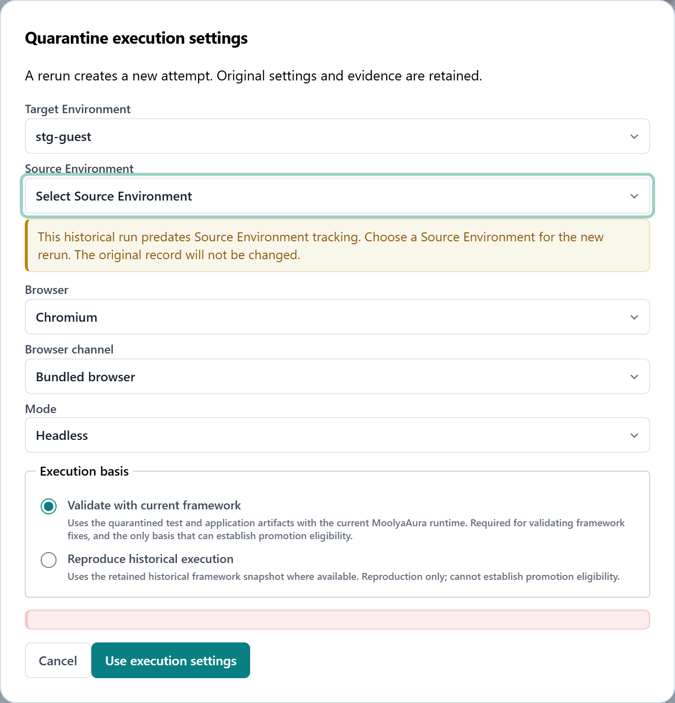

***Figure 26 — Quarantine execution settings, including the Execution basis choice.***

## Two different questions

**Validate with current framework** — *"Is the problem fixed now?"*

> *Uses the quarantined test and application artifacts with the current MoolyaAura runtime.
> Required for validating framework fixes, and the only basis that can establish promotion
> eligibility.*

Your test and your application's Page Objects are taken from the quarantine package; the
**MoolyaAura framework itself comes from today's build**. This is the normal choice and the
default.

**Reproduce historical execution** — *"What exactly happened at the time?"*

> *Uses the retained historical framework snapshot where available. Reproduction only; cannot
> establish promotion eligibility.*

Everything, including the framework of that day, is replayed as it was.

## Why they must never be confused

A quarantine package keeps the framework files that existed when it was made. Replaying them is
exactly right for understanding a historical failure — and exactly wrong for checking a fix,
because the fix is in the framework the replay just overwrote. The run would re-prove the old
bug and blame the test.

This is not hypothetical. A rerun of TC_SMOKE_021 once carried a 40-second locator budget while
executing a *retained* four-second resolver: the settings said forty seconds and the code
reading them had been replaced by its own ancestor. The failure looked like a broken locator.
It was a replay of a bug that had already been fixed.

**A historical replay can never make a case eligible for promotion, however green it is.** Its
result is labelled reproduction-only.

The same dialog also sets Target Environment, Source Environment, Browser, Browser channel and
Mode for the new attempt. The header note is worth trusting: *"A rerun creates a new attempt.
Original settings and evidence are retained."*

---

# 15. Legacy Quarantine Cases

Some quarantine packages were created before MoolyaAura recorded Source Environment. Their
historical metadata genuinely does not contain one, and no later evidence can recover it.


***Figure 27 — A legacy package. Source Environment is empty and the reason is explained.***

MoolyaAura shows exactly this:

> *This historical run predates Source Environment tracking. Choose a Source Environment for
> the new rerun. The original record will not be changed.*

**What you do:** choose a Source Environment for the **new** rerun.

**What happens to the original:** nothing. The historical record continues to say *unknown*,
because that is the truth about it. Your choice is attached to the new attempt and labelled as
your selection — never as recovered history.

**Convenience:** once you have chosen for a revision, later reruns of that same revision
pre-fill your earlier choice. Edit the draft and you are asked again, because different code
deserves a fresh decision.

**What MoolyaAura will not do:** guess. It will not take the target environment, the recording,
or "the only other one" as an answer. An unselected source is refused with a named error until
someone chooses.

---

# 16. Eligibility

```
   Clean execution PASS
        +
   Assertion mutation FAIL
        +
   Execution basis = Validate with current framework
        =
   ELIGIBLE FOR PROMOTION
```

All three are required. Miss any one and the case stays quarantined.

## Eligible is not Promoted

**Eligible** means: *the evidence needed to promote this now exists.*
**Promoted** means: *a person looked at that evidence and decided.*

MoolyaAura never crosses that line for you. There is no setting that auto-promotes a green
case, and the **Promote validated draft** button stays disabled until eligibility is real.

Eligibility is also *specific*: it belongs to the exact revision that was validated. Edit the
draft afterwards and eligibility resets, because what was proven is no longer what you have.

---

# 17. Promotion

**What is this?** Publishing a validated quarantine draft back into the generated suite.


***Figure 28 — The quarantine action bar, including Promote validated draft.***

**How do I use it?** With the case eligible, click **Promote validated draft** and confirm.

## What MoolyaAura checks first

In plain language:

> **MoolyaAura verifies that the files being promoted are the same files that were validated.
> If anything changed after validation, promotion stops and asks for review.**

It checks three groups separately, because they answer different questions:

| Group | What it is | Checked against |
| --- | --- | --- |
| **Test-owned** | The test itself | The exact validated revision |
| **Application-owned** | Your Page Objects, knowledge, fixtures | The copies the validation actually ran with |
| **Shared framework** | MoolyaAura's own engine | The framework the validation actually ran on |

If something moved, the refusal names which group and which file — for example
`APPLICATION_CHANGED_AFTER_VALIDATION` or `FRAMEWORK_CHANGED_AFTER_VALIDATION` (§20).

**Where application files have legitimately moved on** — a colleague added a capability after
your validation — the supported path is to review those changes into a **new revision**. That
creates a new revision, resets eligibility, and requires revalidation, so what ships is what was
proven. Shared framework files are never copied into a draft: they come from the current build
by design.

## What promotion does

- publishes the spec to `tests-e2e/generated/<application>/<TC_ID>.spec.ts`;
- updates the mapping to **Generated**;
- marks the quarantine package **promoted**;
- writes all of it **in one transaction** — it either fully commits or writes nothing.

**What it does not do:** mark the case **Automated**. The product says so in its own
confirmation: *"Explicitly restored to the generated suite. This is not an Automated suite
acceptance."* Automated is earned later by a genuine green run.

---

# 18. Code Workspace

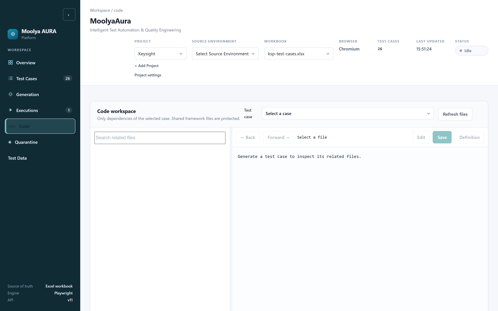

***Figure 29 — The Code workspace.***

**What is this?** A read-and-edit view of the code behind one test case. The product states its
own scope at the top:

> *Only dependencies of the selected case. Shared framework files are protected.*

Pick a test case and you get its generated spec, the Page Objects it uses, the application
fixture and its knowledge — and nothing belonging to other tests.

| Control | What it does |
| --- | --- |
| Click a symbol | Go to its definition |
| **← Back** / **Forward →** | Retrace where you have been |
| **Edit draft** | Enabled only for files you may change |
| **Save** | Validates first; invalid content is kept, not silently dropped |

**Editable:** generated specs, your application's Page Objects, application fixtures, knowledge.
**Protected:** the shared framework — `BasePage`, the locator engine, the diagnostics runtime.
Selecting one shows it read-only with **Edit** disabled. This is why one team's fix cannot
quietly become everyone's regression.

---

# 19. Browser and Environment Behaviour

Browser choice is part of the execution context, not a personal preference — it is recorded with
the run and reproduced on rerun.

| Choice | When to use it |
| --- | --- |
| **Bundled browser** | The default. Ships with MoolyaAura; consistent everywhere. |
| **Installed Chrome / Edge** | When you need the real installed browser. |
| **Headless** | Normal runs. No window. |
| **Headed** | Diagnosing, demonstrating, or where the environment requires it. |

**Some environments require Headed execution.** Sites with strict automated-traffic policies may
serve a challenge page to a headless browser and behave normally for a headed one. This is an
observation about how environments respond, and the remedy is simply to run headed and record
that you did.

MoolyaAura contains no technique for circumventing bot protection, and this guide describes
none. If an environment declines automated access, that is a configuration and access
conversation with whoever owns it.

---

# 20. Error and Troubleshooting Guide

Each error names what was refused and why. None of them is a crash.

### SOURCE_ENVIRONMENT_CONFIGURATION_FAILURE

- **Meaning:** No Source Environment was selected, or the one selected is not configured for
  this application.
- **Likely reason:** The application has several environments and no default, so nothing can be
  assumed.
- **Check:** The **Source Environment** selector in the header; for a quarantine rerun, the
  dialog's Source Environment.
- **Do not:** add a default just to silence it. The refusal happens *before* any browser starts,
  which is the cheapest possible place to be asked.

### CREDENTIAL_CONFIGURATION_FAILURE

- **Meaning:** The run needs an account and cannot get a coherent one.
- **Likely reason:** No credential profile selected for a test that signs in; the profile has no
  entry for this environment; it is inactive; or the selected row and profile disagree.
- **Check:** Test Data → the profile covers **this** environment and is Active; the case's
  selected Execution Data.
- **Do not:** paste credentials into the workbook or a test. They belong in a Credential Profile.

### BROWSER_ENVIRONMENT_ACCESS_FAILURE

- **Meaning:** The browser could not reach the application usefully.
- **Likely reason:** Network or VPN, the environment is down, or it declined automated access.
- **Check:** Open the same URL manually from the same machine. Try **Headed** (§19).
- **Do not:** change locators. Nothing was measured, so nothing about the locator is known.

### PAGE_READINESS_TIMEOUT

- **Meaning:** The element did not appear within 40 seconds, and the page was still visibly
  working — loading, or marked busy.
- **Likely reason:** The application was genuinely slower than the budget.
- **Check:** The step screenshots; whether the environment was under load.
- **Do not:** rewrite the locator. This is a timing finding, not a locator finding.

### LOCATOR_NOT_FOUND_AFTER_READY

- **Meaning:** The page finished loading, declared itself not busy, and the element still was not
  there.
- **Likely reason:** The element genuinely changed, moved, or is gone — or a precondition was not
  met, so you are on a different screen than expected.
- **Check:** The FAILURE screenshot — is this the screen you expected?
- **Do:** If the application changed, update the Page Object method. This is the one category
  where changing the locator is usually right.

### LOCATOR_AMBIGUOUS

- **Meaning:** The locator matched **more than one** element.
- **Likely reason:** The screen now has several things answering the same description.
- **Check:** The screenshot; the candidates listed in the diagnostics.
- **Do not:** ask for "the first one". MoolyaAura deliberately refuses positional narrowing —
  picking by position picks an element nobody chose. Give it something that names the element.

### ASSERTION_FAILURE

- **Meaning:** The element was found; its content or state was not what was expected.
- **Likely reason:** Either the application changed, or the expectation was wrong.
- **Check:** The expected vs actual in the failure, and the screenshot.
- **Note:** This is never healed into a pass. It is a finding about the application until a human
  decides otherwise.

### QUARANTINE_DEPENDENCY_OWNERSHIP_UNKNOWN

- **Meaning:** A file retained in a quarantine package cannot be classified as belonging to the
  test, to your application, or to the shared framework.
- **Likely reason:** A file moved outside the recognised layout, or a retained framework file no
  longer exists.
- **Check:** Report it — this usually indicates a layout or packaging problem, not a test bug.
- **Do not:** work around it. MoolyaAura fails closed rather than running a file from a guessed
  era.

### FRAMEWORK_CHANGED_AFTER_VALIDATION

- **Meaning:** MoolyaAura itself was updated between validating this case and promoting it.
- **Check:** Nothing is wrong with your test. Re-run **Validate with current framework** and
  promote from the fresh result.
- **Do not:** edit the test. It was not the test that changed.

### APPLICATION_CHANGED_AFTER_VALIDATION

- **Meaning:** One of your application's files changed after validation.
- **Likely reason:** A colleague added or changed a Page Object or knowledge file.
- **Check:** Review the change, refresh those reviewed dependencies into a new revision, then
  revalidate (§17).
- **Do not:** promote on the older proof. The point of the check is that what ships is what was
  proven.

---

# 21. Recommended Tester Workflow

A practical daily sequence:

| # | Step | Where |
| --- | --- | --- |
| 1 | Select the **Application** | Header → Project |
| 2 | Select the **Target Environment** | Test Cases → Execution environments |
| 3 | Select the **Source Environment** | Header → Source Environment |
| 4 | Choose **browser and mode** | Test Cases → Run configuration |
| 5 | Choose **Credential / Data Profile** | Test Cases → Choose users & data |
| 6 | Select the **Test Case** | Test case workspace |
| 7 | **Record** | Record a test → Start recording |
| 8 | **Review the mapping** | Recording Review — Page, Page Object, Save Mapping |
| 9 | **Generate** | Generation |
| 10 | **Validate** | Automatic: clean run + assertion mutation |
| 11 | **Review the result** | Generation log / Executions |
| 12 | If quarantined, **diagnose and re-run** | Quarantine → Validate with current framework |
| 13 | When eligible, **review and promote** | Quarantine → Promote validated draft |

Steps 1–5 are configuration; get them right once and the rest of the day is steps 6–13.

---

# 22. End-to-End Example

This walks the real path taken by **TC_SMOKE_021 — "Log In — dashboard-heading contains *My
Dashboard*"**, an existing Keysight case. Every stage below is drawn from evidence the product
retained. No case was modified to produce this chapter.

### Test definition

A row in `ksp-test-cases.xlsx`: sign in, then confirm the dashboard heading reads *My
Dashboard*. See Figure 9.

### Test Data

Credential Profile **kspuserCommon**, configured for `stg-guest`, referenced by ID. No value
appears anywhere. See Figures 5 and 6.

### Recording and Review

The recording captured: open the entry page, click **Log In**, enter the account, enter the
password, submit, then assert the heading. The account and password steps were stored
semantically, not literally. In Review, the controls were bound to `InitialLandingPage` and
`SsoauthLoginPage` as **USER_CONFIRMED** bindings. See Figures 11–15.

### Page Object reuse

Generation reused the existing methods rather than creating new ones — `logIn()`,
`enterEmailField()`, `passwordField()`, `logInButton()`, `myDashboardState()`.

### Generation, clean execution and assertion mutation

The case was validated with **Validate with current framework**, headed, bundled Chromium,
source `stg`, kspuserCommon, 40 000 ms.

| Step | Result |
| --- | --- |
| Open recorded destination | passed |
| `InitialLandingPage.logIn()` | passed |
| `SsoauthLoginPage.enterEmailField()` | passed |
| Enter account from configured credentials | passed |
| Enter password from configured credentials | passed |
| `SsoauthLoginPage.logInButton()` | passed |
| `UsEnHomePage.myDashboardState()` | **passed, 9.5 s** |

The mutated run reached the same final step, **found** the heading, compared its content against
a deliberately impossible value and **failed** after the full 40-second budget.

> Clean PASS + mutation FAIL = validation proven. See §10 and Figure 17.

### Quarantine and the lesson it taught

An earlier rerun of this case had failed — not because the test was wrong, but because the rerun
replayed the framework retained in the package, whose locator budget was four seconds while the
heading took over five. Re-running on the **current framework** passed. This is precisely the
distinction in §14, and why the default is *Validate with current framework*.

### Eligible, then promoted

With clean PASS, mutation FAIL and the correct execution basis, the case became **eligible** —
and stayed at `promoted: false` until a person promoted it. After promotion the quarantine list
shows it as *Promoted to generated suite* (Figure 20), the spec is published under
`tests-e2e/generated/ksp/`, and the mapping reads **Generated** — not Automated.

```
   TC_SMOKE_021
        |
   Test definition  ->  Test Data (kspuserCommon)
        |
   Recording  ->  Recording Review  ->  Page mapping  ->  Page Object reuse
        |
   Generation
        |
   Clean execution  PASS        Assertion mutation  FAIL
        |
   Current Framework Validation
        |
   ELIGIBLE  ->  (human decision)  ->  PROMOTED
```

---

## Appendix — What is not in the dashboard

Stated so you do not look for it:

- **Locator timeout** is fixed framework policy at 40 000 ms; there is no field to change it.
- **Automation status** cannot be set by hand; *Automated* is earned by a green run.
- **Auto-promotion** does not exist. Promotion is always an explicit human action.
- **Credential values** are never displayed after saving — only *"configured"*.
- **Shared framework files** cannot be edited from the Code Workspace or a quarantine draft.

---

*End of guide.*
